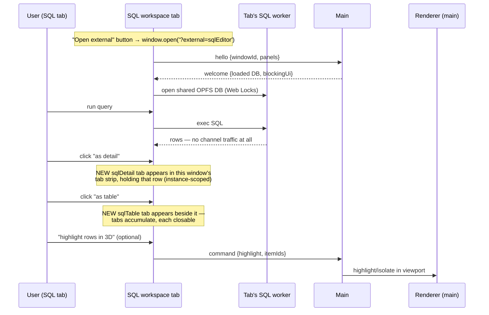
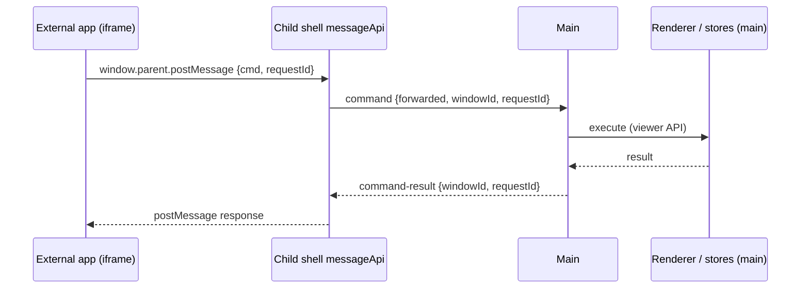

# Multi-tab external panels — design capture (PARKED)

**Status: PARKED — do not build yet.** Wait until the main app has settled;
the structural edits below should land as part of normal main-app work
first, so this feature bolts on instead of being carved out. Re-verify all
file references at implementation time.

## Goal

Pop a small, deliberate set of panels out into a **real browser tab**
(`window.open`):

1. **SQL editor → "SQL workspace tab"** — the headline case. An **"Open
   external" action button** in the SQL editor's toolbar opens a new browser
   tab that is an *independent SQL workspace*. The window is a tabbed dock:
   the SQL editor is the **first tab in the window's tab strip**, and every
   "as table" / "as detail" click there opens a **new tab** beside it in the
   same window (multiple table/detail tabs can pile up; each is closable).
   Nothing about the SQL working state (query, selected row, open tabs) is
   shared with the main window or other tabs — two workspaces with two
   different queries over the same database is exactly the point.
2. **External-app panels (`ext:<appId>` iframes)** — poppable because they
   already live in their own space; popping out creates a fresh iframe
   instance of the app in the new tab.

Everything else stays in the main window for v1 (`externalizable: false`).
The mechanism is general — widening later to e.g. hierarchy is a config
change plus the extension layer sketched at the end, not a redesign. The
**viewport can never be externalized**: its `GPUDevice`, canvas context and
model workers cannot leave the main tab.

## Decisions (director)

- **v1 scope: SQL editor + external-app panels only.** Not "any panel".
  Most panels exist to drive/annotate the viewport, which lives in the other
  window anyway; SQL is the one subsystem whose data layer is fully
  self-contained per tab.
- **SQL workspace state is tab-local, not synced.** A separate window is a
  separate JS context, so the existing global `createStore` singletons are
  *naturally* per-tab — isolation is free precisely because we do NOT sync
  the SQL stores. Detail-follows-click works unchanged because it's the same
  store wiring, just living in another window.
- **Trigger = explicit "Open external" action button, NOT dock machinery.**
  To keep this simple and not mix it with float/dialog/pop-out semantics,
  there is no generic externalize affordance on tab headers or dialog title
  bars — the SQL editor gets an "Open external" button in its own toolbar
  (external apps get the equivalent per-app action). The `DockManager` is
  untouched. The main window's editor stays exactly where it is; the new
  tab is a *fresh* independent workspace, so there are no move/close
  semantics to define.
- **Workers stay in the main window** (model DB / cooker / import).
  **Exception: the SQL worker** — it coordinates through the Web Locks API,
  so every tab runs its own instance against the shared OPFS database
  (imports already normalize out of WAL, so shared reads are safe).
- **Transport: BroadcastChannel** (not per-child postMessage). Fan-out to N
  tabs for free, survives a child F5 without re-plumbing a `WindowProxy`,
  symmetric. Messages carry a `windowId` when one window must be targeted.
- **Main is authoritative** for everything that IS shared (blocking state,
  which DB/model is loaded, viewer commands).
- **Main-window death → non-closable modal** in every child: "Main window
  closed — disconnected." Only closing the tab gets rid of it
  (auto-reconnect if a main comes back is a cheap bonus).
- **Blocking UI is global.** A loading overlay or error dialog in one window
  shows in *all* windows and blocks input everywhere — plus main rejects
  incoming commands while blocked (a child can be one heartbeat behind, so
  the overlay alone is not enough).

## Architecture

### Channel (`src/external/channel.ts`)

Typed wrapper over `BroadcastChannel('t3d-external')`. Message types:

- `hello` / `welcome` — child handshake; `welcome` carries the shared-state
  snapshot (which DB/model is loaded, blocking state) so a fresh or
  reloaded child hydrates instantly.
- `store-patch` — main → children updates for the small shared whitelist.
- `command` — child → main imperative calls (highlight items, dismiss
  dialog, forwarded external-app API calls). Main replies
  `command-rejected {windowId}` while blocked.
- `heartbeat` (~1 s) and `main-bye` (on `pagehide`) — liveness.

### Child entry

- `?external=<panelIds>` query param, same convention as `?kiosk=1`.
  `src/main.tsx` branches: render `<ExternalApp/>` instead of `<App/>`.
- `ExternalApp` (`src/external/ExternalApp.tsx`): no viewport, no renderer.
  Mini top strip + one `DockManager` tabs node. Boots its own SQL worker;
  runs `initSettingsSync` so theme/settings arrive via the existing
  localStorage channel. Panel set mirrored to URL/sessionStorage so F5
  restores the tab.
- Panel definitions shared with the main app — requires the registry
  extraction listed under structural prep.

### SQL workspace tab

- "Open external" button in the sqlEditor toolbar → new browser tab with a
  fresh sqlEditor instance. Its query/result/selection state starts clean
  and stays tab-local; the main window's editor is unaffected.
- **Window layout = one tabs node.** The editor is the first tab; every
  "as table" / "as detail" click opens a **new closable tab** in the same
  window's tab strip, via the panel's local `PanelContext`/DockManager —
  never a global reference to main's manager (prep check below).
- **New-tab-per-click means multiple sqlTable/sqlDetail instances live in
  ONE window**, so they can't all read a single global "current result /
  selected row" store — each tab gets its data at open time
  (instance-scoped state). Register them as dynamic per-instance panels
  (`sqlTable:<n>`, `sqlDetail:<n>`) — the runtime `ext:<appId>`
  registration in `RibbonExternal.tsx` is the existing precedent for
  dynamic panel ids.
- Small open point: does a detail tab stay **pinned** to the row it was
  opened with, or **live-follow** subsequent clicks in the editor tab?
  Pinned per-tab (plus closing/reopening for a new row) is the simpler,
  probably-right default; decide at build time.
- Data: the tab's own SQL worker on the shared OPFS DB. Main only tells it
  *which* DB is loaded (`welcome` + `store-patch`) and when the DB is being
  rewritten (`blockingUi` during import → overlay + the tab's worker
  closes/reopens the DB around it).
- Optional nice-to-have: "highlight result rows in 3D" — a `command` with
  item ids; main runs it against the real renderer. This is the *only*
  renderer touchpoint in v1.

### External-app tabs (`ext:<appId>`)

- Per-app "open in external tab" action (in the External ribbon / app
  config, alongside the existing panel/dialog/newWindow modes) → the app
  opens as an iframe panel in a new external tab (fresh instance; iframe
  state is not transplantable — accepted).
- **API forwarding is the real work here:** external apps talk to the viewer
  via `window.parent.postMessage`, but in an external tab the parent is the
  child shell, not main. The child shell runs a minimal messageApi listener
  that forwards viewer commands over the channel to main and relays
  responses back (request-id correlation). The per-window instance data in
  `messageApi.ts` stays per-window — each pop-out is its own instance.
- Open point: for apps configured as `newWindow` the existing plain
  `window.open(url)` path already exists; the shell-hosted variant buys the
  mini-top (mixing app + SQL panels in one tab) and API forwarding. Decide
  at build time whether both modes stay.

### UI affordances

- **"Open external" action button** in the sqlEditor toolbar (and a per-app
  equivalent for external apps). Plain `window.open('?external=…')` — no
  `DockManager` involvement, no new panel flags, no interaction with the
  float/dialog system.
- The child shell keeps a slim top strip with the tab row (detail/table
  land there as they open). A panel-picker for adding more panels is
  **optional polish**, not v1-required — the workspace populates itself
  from the editor's own detail/table actions.
- Every new button gets a tooltip + hotkey binding (house rule).

### Shared-state sync (`src/external/externalSync.ts`)

Deliberately tiny in v1 — main broadcasts patches for:

- `blockingUi` (below),
- loaded DB/model identity,
- external-window bookkeeping.

SQL working state is NOT in the whitelist (tab-local by design). Settings/
theme ride the existing `settingsSync.ts` localStorage channel unchanged.

### Blocking UI (`blockingUi` store, main-authoritative)

`{ kind: 'loading' | 'error', title, message, progress?, source } | null`.
Whatever drives today's loading overlays and error dialogs is routed through
this store; every window renders the same input-blocking overlay from it.
Dismiss in one window = `command` to main = cleared everywhere. Main's
command handler rejects/queues while non-null (defense in depth).

### Main-side bookkeeping

`src/state/externalWindows.state.ts`: live children (windowId → panels),
fed by handshakes/heartbeats. Feeds "open in external tab" indicators.

## Data / event flow

### Topology — who lives where

```
                     MAIN WINDOW (authoritative)
  ┌──────────────────────────────────────────────────────────────┐
  │  viewport ──► Renderer (GPUDevice — never leaves this tab)   │
  │  model-DB / import / cooker workers (Comlink, main-only)     │
  │  own SQL worker · sqlEditor/detail/table (main's instances)  │
  │                                     ┌─────────────────┐      │
  │  blockingUi / loaded-DB stores ◄────┤  externalSync   │      │
  │  renderer ◄── highlight cmds ───────│ + command guard │      │
  └─────────────────────────────────────┴───────┬─▲───────┴──────┘
        store-patch / welcome /                 │ │   hello / command /
        heartbeat / main-bye                    ▼ │   forwarded app API
  ═══════════════ BroadcastChannel('t3d-external') ═══════════════
                  │ ▲                            │ ▲
  ┌───────────────▼─┴──────────┐  ┌──────────────▼─┴────────────┐
  │ SQL WORKSPACE TAB          │  │ EXTERNAL-APP TAB            │
  │ [editor|table:1|detail:1…] │  │ iframe (fresh instance)     │
  │  tab strip, all tab-local  │  │   │ postMessage             │
  │ own SQL worker ────────────┼─┐│   ▼                         │
  │ blocking overlay (synced)  │ ││ shell messageApi ─► forward │
  └────────────────────────────┘ │└─────────────────────────────┘
                                 └──► shared OPFS DB (Web Locks)
```

The only data path that bypasses main is each tab's SQL worker reading the
shared OPFS database directly (Web Locks arbitrates). SQL working state
never crosses the channel at all.

### SQL workspace — open, query, detail, optional highlight



### External-app tab — API forwarding



### Blocking + liveness — overlay everywhere, guard, disconnect

```mermaid
sequenceDiagram
    participant M as Main
    participant A as SQL tab
    participant B as App tab

    Note over M: model/DB import starts
    M-->>A: store-patch {blockingUi: loading}
    M-->>B: store-patch {blockingUi: loading}
    Note over A,B: overlay ON, input blocked;<br/>SQL tab closes DB handle during rewrite
    B->>M: command (stale tab, one beat behind)
    M-->>B: command-rejected — guard, defense in depth
    M-->>A: store-patch {blockingUi: null}
    M-->>B: store-patch {blockingUi: null}

    loop every ~1 s
        M-->>A: heartbeat
        M-->>B: heartbeat
    end
    Note over M: main tab closed
    M--xA: main-bye (pagehide) — or 3 missed heartbeats
    M--xB: main-bye
    Note over A,B: non-closable "Main window closed" modal;<br/>optional: hello from a fresh main → auto-reconnect
```

## Structural prep — do these in the main app FIRST

Worth doing regardless; the reason to delay is to land these as normal
refactors so multi-tab becomes mostly additive.

1. **Extract the panel registry out of `App.tsx`** (the `panels:
   PanelDefinition[]` array, ~lines 90–139) into e.g. `src/appPanels.tsx` so
   a second entry point can import it without dragging in the whole app.
2. **Local-manager discipline + instance-scoped SQL panels.** Opening
   detail/table from the editor/table must go through the panel's own
   `PanelContext`/DockManager, never a module-global manager reference. And
   sqlTable/sqlDetail need to work as **multiple simultaneous instances**
   fed data at open time (dynamic `sqlDetail:<n>` registration, like
   `ext:<appId>`), not as singletons reading one global selected-row store.
   Both are what make new-tab-per-click work; the main window benefits too
   (compare several details side by side).
3. **Unify blocking overlays.** Move loading/error dialogs (import manager,
   model load, SQL errors — audit whether it's one mechanism or several)
   behind the single `blockingUi` store now; the main app benefits
   immediately and sync becomes trivial later.
4. **SQL worker lifecycle.** Make open/close of the OPFS DB re-entrant and
   observable (needed anyway for import-time rewrites; the external tab
   reuses it around `blockingUi`).
5. **messageApi forwarding seam.** Keep the command-execution side of
   `messageApi.ts` separable from the window-listener side, so the child
   shell can reuse the protocol with a channel transport behind it.

## Future extension (out of v1 scope)

Widening beyond SQL + external apps (hierarchy, viewpoints, measurements)
would additionally need: model-DB queries proxied over the channel
(`rpc`/`rpc-result` to main's Comlink worker), a renderer proxy implementing
the subset of `getRenderer()` calls panels make (~24 call sites — funnel
them through one dispatch seam first), and syncing the content stores
`settingsSync` deliberately skips (selection/hover, measurements, labels,
color rules, viewpoints). It would also be the point to revisit a generic
dock-level externalize affordance (an up-arrow on tab headers / dialog
title bars, gated by a `PanelDefinition.externalizable` flag) — deliberately
left out of v1 to avoid mixing with the float/dialog machinery. The v1
channel/shell/liveness layer is already shaped for all of this; nothing in
v1 needs reworking to add it.

## Phasing (when unparked)

1. **Skeleton** — channel + heartbeat + disconnect modal, `?external=`
   entry + `ExternalApp` shell, "Open external" button in the sqlEditor
   toolbar, panel-registry extraction (if not already landed).
2. **SQL workspace** — per-tab SQL worker on the shared DB, loaded-DB
   sync, tab-local detail/table opening, `blockingUi` overlay +
   reject-while-blocked.
3. **External-app tabs** — iframe panel in the child shell + messageApi
   forwarding over the channel.
4. **Polish** — mini-top add-panel picker, optional highlight-in-3D
   command, hotkeys, tooltips.

No new npm/Rust dependencies (BroadcastChannel and Web Locks are native), so
no third-party-notices regen. The host postMessage SDK / `EVENTS.md` is
untouched — the internal channel is not part of the embedding protocol, and
the child shell only *forwards* the existing protocol.
